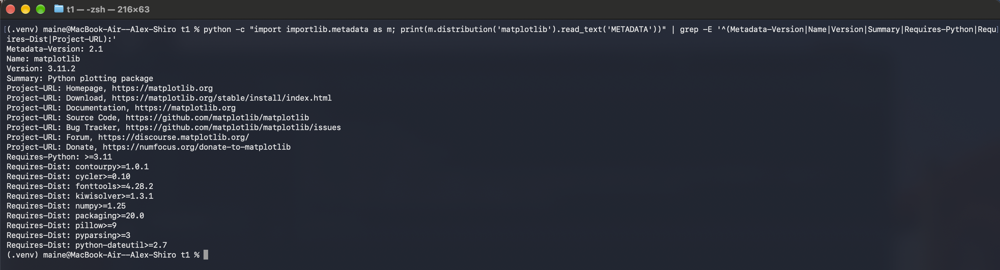
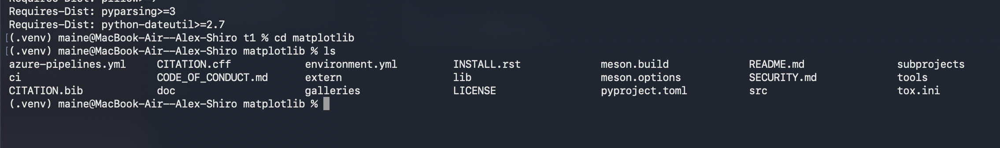
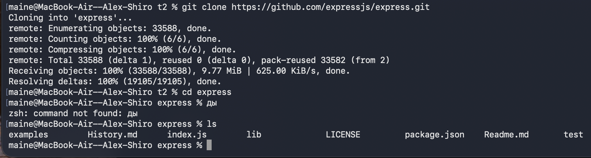
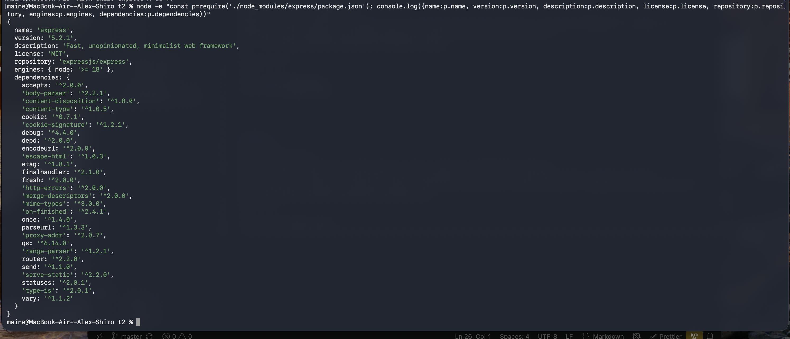
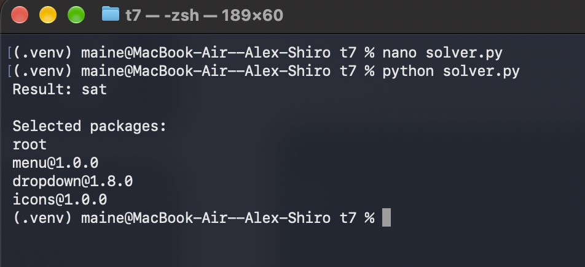

# task 1
python3 -m venv .venv
source .venv/bin/activate
python -m pip install matplotlib
python -m pip show matplotlib
python -c "import importlib.metadata as m; print(m.distribution('matplotlib').read_text('METADATA'))" | grep -E '^(Metadata-Version|Name|Version|Summary|Requires-Python|Requires-Dist|Project-URL):'
git clone https://github.com/matplotlib/matplotlib.git
ls
cd matplotlib
ls

# task 2
npm init -y
npm install express
npm view express name version description license repository dependencies engines
node -e "const p=require('./node_modules/express/package.json'); console.log({name:p.name, version:p.version, description:p.description, license:p.license, repository:p.repository, engines:p.engines, dependencies:p.dependencies})"
git clone https://github.com/expressjs/express.git
cd express
ls

# task 3
1. matplotlib:
nano matplotlib.dot
digraph matplotlib {
    rankdir=LR;
    node [shape=box];

    "matplotlib 3.11.2" [shape=ellipse];

    "matplotlib 3.11.2" -> "contourpy >=1.0.1";
    "matplotlib 3.11.2" -> "cycler >=0.10";
    "matplotlib 3.11.2" -> "fonttools >=4.28.2";
    "matplotlib 3.11.2" -> "kiwisolver >=1.3.1";
    "matplotlib 3.11.2" -> "numpy >=1.25";
    "matplotlib 3.11.2" -> "packaging >=20.0";
    "matplotlib 3.11.2" -> "pillow >=9";
    "matplotlib 3.11.2" -> "pyparsing >=3";
    "matplotlib 3.11.2" -> "python-dateutil >=2.7";
}
cat matplotlib.dot
dot -Tpng matplotlib.dot -o matplotlib.png
open matplotlib.png

2. express:
nano express.dot
digraph express {
    rankdir=LR;
    node [shape=box];

    "express 5.2.1" [shape=ellipse];

    "express 5.2.1" -> "accepts ^2.0.0";
    "express 5.2.1" -> "body-parser ^2.2.1";
    "express 5.2.1" -> "content-disposition ^1.0.0";
    "express 5.2.1" -> "content-type ^1.0.5";
    "express 5.2.1" -> "cookie ^0.7.1";
    "express 5.2.1" -> "cookie-signature ^1.2.1";
    "express 5.2.1" -> "debug ^4.4.0";
    "express 5.2.1" -> "depd ^2.0.0";
    "express 5.2.1" -> "encodeurl ^2.0.0";
    "express 5.2.1" -> "escape-html ^1.0.3";
    "express 5.2.1" -> "etag ^1.8.1";
    "express 5.2.1" -> "finalhandler ^2.1.0";
    "express 5.2.1" -> "fresh ^2.0.0";
    "express 5.2.1" -> "http-errors ^2.0.0";
    "express 5.2.1" -> "merge-descriptors ^2.0.0";
    "express 5.2.1" -> "mime-types ^3.0.0";
    "express 5.2.1" -> "on-finished ^2.4.1";
    "express 5.2.1" -> "once ^1.4.0";
    "express 5.2.1" -> "parseurl ^1.3.3";
    "express 5.2.1" -> "proxy-addr ^2.0.7";
    "express 5.2.1" -> "qs ^6.14.0";
    "express 5.2.1" -> "range-parser ^1.2.1";
    "express 5.2.1" -> "router ^2.2.0";
    "express 5.2.1" -> "send ^1.1.0";
    "express 5.2.1" -> "serve-static ^2.2.0";
    "express 5.2.1" -> "statuses ^2.0.1";
    "express 5.2.1" -> "type-is ^2.0.1";
    "express 5.2.1" -> "vary ^1.1.2";
}
cat express.dot
dot -Tpng express.dot -o express.png
open express.png

# task 4
open -a MiniZincIDE

include "alldifferent.mzn";

array[1..6] of var 0..9: d;

constraint all_different(d);

constraint d[1] + d[2] + d[3] =
           d[4] + d[5] + d[6];

var int: s = d[1] + d[2] + d[3];

solve minimize s;

output [
    "ticket = ",
    show(d[1]), show(d[2]), show(d[3]),
    show(d[4]), show(d[5]), show(d[6]),
    "\nsum = ", show(s)
];

# task 5
open -a MiniZincIDE
enum Menu = {
    menu_1_5_0,
    menu_1_4_0,
    menu_1_3_0,
    menu_1_2_0,
    menu_1_1_0,
    menu_1_0_0
};

enum Dropdown = {
    drop_2_3_0,
    drop_2_2_0,
    drop_2_1_0,
    drop_2_0_0,
    drop_1_8_0
};

enum Icons = {
    icon_2_0_0,
    icon_1_0_0
};

array[Menu, Dropdown] of bool: MenuDropdown =
[| true,  true,  true,  true,  false
 | true,  true,  true,  true,  false
 | true,  true,  true,  true,  false
 | true,  true,  true,  true,  false
 | true,  true,  true,  true,  false
 | false, false, false, false, true
|];

array[Icons, Dropdown] of bool: DropdownIcons =
[| true,  true,  true,  true,  false
 | false, false, false, false, true
|];

var Menu: selectedMenu;
var Dropdown: selectedDropdown;
var Icons: selectedIcons;

constraint MenuDropdown[selectedMenu, selectedDropdown];

constraint selectedIcons = icon_1_0_0;

constraint DropdownIcons[selectedIcons, selectedDropdown];

solve satisfy;

output [
    "menu = ", show(selectedMenu), "\n",
    "dropdown = ", show(selectedDropdown), "\n",
    "icons = ", show(selectedIcons), "\n"
];

# task 6
open -a MiniZincIDE
var bool: root_1_0_0;

var bool: foo_1_0_0;
var bool: foo_1_1_0;

var bool: left_1_0_0;
var bool: right_1_0_0;

var bool: shared_1_0_0;
var bool: shared_2_0_0;

var bool: target_1_0_0;
var bool: target_2_0_0;

% root обязательно установлен
constraint root_1_0_0 = true;

% root 1.0.0 -> foo ^1.0.0 и target ^2.0.0
constraint root_1_0_0 ->
    ((foo_1_0_0 \/ foo_1_1_0) /\ target_2_0_0);

% одновременно можно выбрать только одну версию foo
constraint not (foo_1_0_0 /\ foo_1_1_0);

% foo 1.1.0 -> left ^1.0.0 и right ^1.0.0
constraint foo_1_1_0 ->
    (left_1_0_0 /\ right_1_0_0);

% foo 1.0.0 зависимостей не имеет

% left 1.0.0 -> shared >=1.0.0
constraint left_1_0_0 ->
    (shared_1_0_0 \/ shared_2_0_0);

% right 1.0.0 -> shared <2.0.0
constraint right_1_0_0 ->
    shared_1_0_0;

% только одна версия shared
constraint not (shared_1_0_0 /\ shared_2_0_0);

% shared 1.0.0 -> target ^1.0.0
constraint shared_1_0_0 ->
    target_1_0_0;

% только одна версия target
constraint not (target_1_0_0 /\ target_2_0_0);

% Минимизируем количество установленных пакетов
var int: total =
    bool2int(root_1_0_0) +
    bool2int(foo_1_0_0) +
    bool2int(foo_1_1_0) +
    bool2int(left_1_0_0) +
    bool2int(right_1_0_0) +
    bool2int(shared_1_0_0) +
    bool2int(shared_2_0_0) +
    bool2int(target_1_0_0) +
    bool2int(target_2_0_0);

solve minimize total;

output [
    "root 1.0.0 = ", show(root_1_0_0), "\n",
    "foo 1.0.0 = ", show(foo_1_0_0), "\n",
    "foo 1.1.0 = ", show(foo_1_1_0), "\n",
    "left 1.0.0 = ", show(left_1_0_0), "\n",
    "right 1.0.0 = ", show(right_1_0_0), "\n",
    "shared 1.0.0 = ", show(shared_1_0_0), "\n",
    "shared 2.0.0 = ", show(shared_2_0_0), "\n",
    "target 1.0.0 = ", show(target_1_0_0), "\n",
    "target 2.0.0 = ", show(target_2_0_0), "\n"
];

# task 7

import json
from collections import defaultdict
from z3 import Bool, Or, Implies, AtMost, Optimize, Sum, If, is_true

Читаем метаданные пакетов
with open("dependencies.json", "r") as f:
    packages = json.load(f)

Для каждого пакета/версии автоматически создаём переменную
variables = {}

for i, package in enumerate(packages):
    variables[package] = Bool(f"package_{i}")

solver = Optimize()

root должен быть установлен
solver.add(variables["root"])

Автоматически строим ограничения зависимостей
for package, dependency_groups in packages.items():

    for alternatives in dependency_groups:

        possible_versions = [
            variables[dependency]
            for dependency in alternatives
        ]

        solver.add(
            Implies(
                variables[package],
                Or(possible_versions)
            )
        )

Группируем разные версии одного пакета
versions = defaultdict(list)

for package in packages:

    if package == "root":
        continue

    name = package.split("@")[0]

    versions[name].append(
        variables[package]
    )

Нельзя одновременно установить две версии одного пакета
for name, package_versions in versions.items():

    if len(package_versions) > 1:
        solver.add(
            AtMost(*package_versions, 1)
        )

Выбираем минимальное количество пакетов
solver.minimize(
    Sum([
        If(variable, 1, 0)
        for variable in variables.values()
    ])
)

result = solver.check()

print("Result:", result)

if str(result) == "sat":

    model = solver.model()

    print("\nSelected packages:")

    for package, variable in variables.items():

        if is_true(model.eval(variable)):
            print(package)
